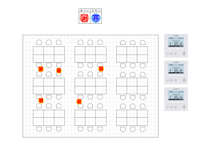

include::preamble.adoc[]
= 体感室温共有システム せつでんくん: 要件定義書

== 背景・目的

フロア内の体感室温の表明、空調の設定変更、フロアマップの管理をシステムの業務スコープとする。

* 利用者による暑い・寒いの体感表明を行う「体感室温表明業務」
* 空調の温度設定などを変更する「空調変更業務」
* 管理者によるフロアマップの登録・変更を行う「フロアマップ管理業務」
* 管理者による認証情報の登録・更新を行う「認証情報管理業務」

.ビジネスコンテキスト
[plantuml]
----
include::business-context.puml[]
----

システム化の目的は下記のとおり。

.システムコンテキスト
[plantuml]
----
include::system-context.puml[]
----

== 機能要件

ヒアリングで出てきた要求事項から、実現すべき重要な要件を下記のように設定した。

.要求モデル
[plantuml]
----
include::requirement-model.puml[]
----

== 業務分析とユースケース

=== 体感室温表明、空調設定変更

フロアが暑過ぎたり寒すぎたりした場合、利用者は下記のことを行う。

. 「自分がどう感じているか」をフロアマップに表明する
. 「他の人たちはどう感じているか」という情報を参考にして空調の温度設定を調整する

また、システムは自動で下記のことを行う。

. 定められた時間ごとにWebカメラを操作し、空調リモコンの表示部を撮影してその画像を記録する。

.ユーザーのビジネスユースケース
[plantuml]
----
include::user-buc.puml[]
----

.空調設定変更の業務フロー
[plantuml]
----
include::user-flow.puml[]
----

.体感室温表明の利用シーン
[plantuml]
----
include::user-scene.puml[]
----

.空条温度確認のシステム連携
[plantuml]
----
include::system-usecase-webcam.puml[]
----

==== 体感室温表明のユースケース

.フロアマップ画面のサンプル

主要シナリオ::
. 「せつでんくん」ログイン画面にアクセスする
. フロア名とパスワードを入力してログインボタンを押す
. 暑さ寒さの程度によって（暑）や（寒）のアイコンの大きさを選ぶ
. フロアマップの自席付近にアイコンを設置する

例外ケース::
パスワードが分からない場合:::
. 社内掲示板にアクセスる
. 「せつでんくん」パスワードの変更通知を検索する
. 主要シナリオの 1. へ

.ログインのユースケース詳細
[plantuml]
----
include::user-usecase-login.puml[]
----

.体感室温表明のユースケース詳細
[plantuml]
----
include::user-usecase-clame.puml[]
----

==== 空調設定記録のユースケース

前提条件::
. Webカメラとそれを操作するための端末を、空調リモコンの近くに設置し、
リモコンの表示部がはっきり撮影できるようにカメラの角度などを調節しておくこと。
. 端末に当システムのソフトウェアをインストールし、タイマーで定期的に実行できるように設定すること。

主要シナリオ::
. システムはタイマーによって処理を開始する
. Webカメラで空調リモコンの表示部を撮影する
. 撮影した画像を空調設定内容として記録する
例外ケース::
Webカメラが故障しているとき:::
. 空調設定内容にカメラ故障という記録をつける
Webカメラにリモコンの表示部が映らないとき:::
. システムでは検知できないため、当ユースケースでは正常処理として取り扱う
. その代わり空調設定確認のユースケースにて対応する

.空調設定記録のユースケース詳細
[plantuml]
----
include::system-usecase-record.puml[]
----

==== 体感室温確認と空調設定確認のユースケース

主要シナリオ::
. 「せつでんくん」ログイン画面にアクセスする
. フロア名とパスワードを入力してログインボタンを押す
. フロアマップ上のアイコンの数や分布を確認する
. フロアマップに併設されている空調リモコンの画像を確認する

例外ケース::
リモコンの画像がちゃんと映っていないとき:::
. 管理担当者に連絡する
. 管理担当者はWebカメラと端末を調査して対応する

.体感室温確認と空調設定確認のユースケース詳細
[plantuml]
----
include::user-usecase-view.puml[]
----

=== フロアマップ管理、認証情報管理

.管理担当者のビジネスユースケース
[plantuml]
----
include::admin-buc.puml[]
----

.フロアマップ追加・変更・削除の業務フロー
[plantuml]
----
include::admin-flow.puml[]
----

==== フロアマップ追加・変更・削除のユースケース

主要シナリオ::
フロアマップの追加:::
. 「せつでんくん」管理用ログイン画面にアクセスする
. ユーザーIDとパスワードを入力してログインボタンをクリックする
. フロアマップ一覧画面に遷移する
. フロアの追加ボタンをクリックする
. フロア名とマップ画像を入力して登録ボタンをクリックする

フロアマップの変更:::
. フロアマップ追加の 3. より
. 対象となるフロアの変更ボタンをクリックする
. 新しいマップ画像をアップロードする

フロアマップの削除:::
. フロアマップ追加の 3. より
. 対象となるフロアの削除ボタンをクリックする

.フロアマップ追加のユースケース詳細
[plantuml]
----
include::admin-usecase-create.puml[]
----

.フロアマップ変更のユースケース詳細
[plantuml]
----
include::admin-usecase-edit.puml[]
----

.フロアマップ削除のユースケース詳細
[plantuml]
----
include::admin-usecase-delete.puml[]
----

== ビジネスルール

* 体感室温情報は、表明から1時間の間、フロアマップ上に表示されること。
* 空調リモコンの画像は1分おきに自動的・定期的に撮影され、フロアマップ上に表示されること。
* 認証情報は1か月に1度更新され、社内掲示板で周知されること。
* 利用者は、社内Webシステムにアクセス権を持ち、フロアで作業を行う従業員とすること。

=== 情報モデル

.情報モデル図
[plantuml]
----
include::info-model.puml[]
----

=== 状態モデル

.体感温度情報の状態モデル図
[plantuml]
----
@startuml

[*] -> 表示中 : 表明された
表示中 -> 表示中 : 再度表明した
表示中 --> 削除済 : 時間経過
削除済 -> [*]

@enduml
----

== 非機能要件

=== 性能要件
==== パフォーマンス
* 同時接続数 5人/分
* 応答時間 1秒以内

==== 可用性
* データの日次バックアップを行なうこと。
* データベースの障害時にはバックアップからリストアを行なえること。

=== 利用環境

Webブラウザ::
* Chrome （最新のやつ）
* Firefox （最新のやつ）
* MS Edge （最新のやつ）
* Safari （最新のやつ）
OS::
** Windows 10 / 11
** macOS  10.15 Catalina / 11 Big Sur
** iOS (iPhone, iPad) 14.x / 15.x
** Android 10 / 11

=== セキュリティ

* Webで公開している画面についてXSSやインジェクション等の脆弱性対応を行うこと。
* 利用しているライブラリやフレームワーク等に重大な脆弱性が発表されていないか確認し、対応を行うこと。

==== テスト

* 単体テスト、結合テスト、負荷テスト、脆弱性テストを行うこと。
* それぞれテスト項目書を作成し、レビューを行うこと。
* テスト実施時には結果報告書を作成すること。

==== 移行

* 移行すべき旧システムが存在しないため、本項目は記載なし。

==== インフラ

* オンプレミスでサーバーを持たないため、クラウドサービスを利用すること。
* なるべく低コスト、できれば無料のサービスを利用すること。
